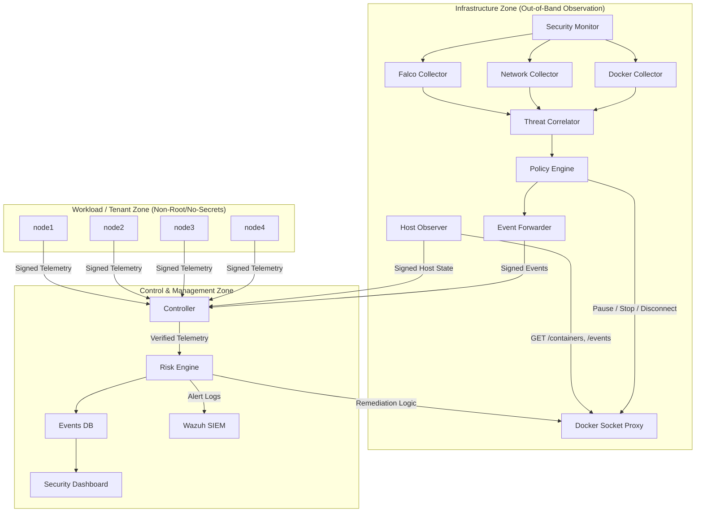
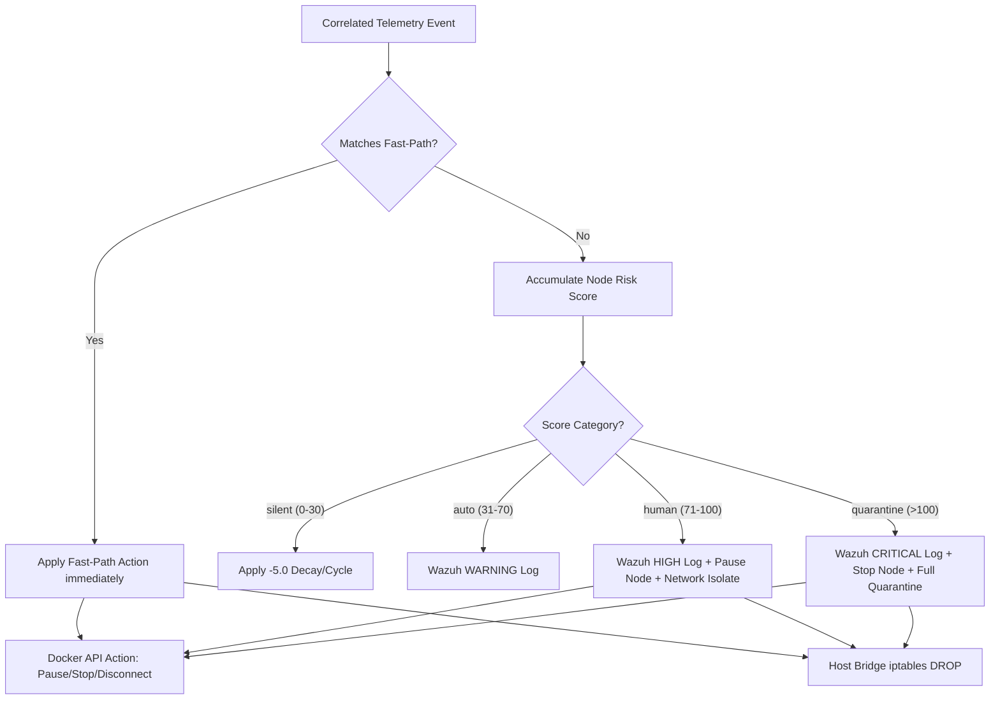

# HPC Security Architecture & Monitoring Specifications

This document provides a comprehensive, section-wise reference of the security monitoring capabilities, configurations, telemetry collection rules, and automated response patterns enforced across the Always-On Security platform.

---

## 1. System Zone & Communications Architecture

The platform enforces isolation between tenant containers and the infrastructure monitoring system. Telemetry flows securely across zoned boundaries:

### Zone Definitions

1. **Workload Zone (node1 - node4)**: Tenant compute and storage containers. They run unprivileged under a non-root account (`appuser` UID `10001`), have no access to the Docker socket, and lack the cryptographic HMAC key.
2. **Infrastructure Zone**: Hosts passive observation sensors (`host-observer`, `security-monitor`, `falco`). These components execute outside the tenant space, inspecting resource state and container telemetry via a scoped **Docker Socket Proxy** which restricts writable endpoint exposure.
3. **Control Zone**: A cryptographically guarded administrative plane that runs the telemetry ingester (`controller`), risk analysis engine (`risk-engine`), security data store (`dashboard/app.py`), and compliance log collector (`alert_ingestor`).

---

## 2. Network Security Monitoring (NIDS & NADS)

Network monitoring utilizes passive traffic inspection and network anomaly detection (NADS) to discover probing, unauthorized tunnels, and lateral spread.

### Sniffing Points & normalizers

- **Suricata Engine**: Sniffs the virtual network bridge interface (`eth0`) in the Infrastructure Zone. Mapped rule events are exported to `eve.json`.
- **Zeek Core Scripting**: Monitors protocol transactions and generates connection-oriented statistics (`conn.log`) and notices (`notice.log`).
- **Network Collector**: Continuously parses Suricata alerts and Zeek notices, normalizing them into structured security events.

### Enforced Rules & Detections

#### A. Suricata Signatures (`hpc-scan.rules`)

- **HPC Fast Port Scan (SID 9000101)**: Triggered when a source IP initiates more than 15 TCP SYN connections in 30 seconds.
- **HPC Slow Port Scan (SID 9000102)**: Triggered when a source IP initiates more than 40 TCP SYN connections in 600 seconds.
- **ICMP Payload Tunneling (SID 9000001)**: Flags ICMP packets containing data payloads greater than 64 bytes (indicative of C2 tunneling).
- **HTTP on Non-Standard Port (SID 9000002)**: Detects HTTP protocol commands directed to ports other than standard 80.
- **SSH on Non-Standard Port (SID 9000003)**: Detects SSH handshakes on ports other than standard 22.

#### B. Zeek Scripts (`hpc_monitor.zeek` & `zeek_emulator.py`)

- **Unauthorized Communication (`Unauthorized_Comm`)**: Flags when a container attempts to establish communication with an out-of-topology neighbor. The approved network map is defined in `zeek_init()`:
  - Allowed: `node1` $\leftrightarrow$ `node2`, `node2` $\leftrightarrow$ `node3`, `node3` $\leftrightarrow$ `node4` (storage gateway).
  - Violations trigger an immediate notice.
- **Protocol Mismatch (`Protocol_Mismatch`)**: Flags when a container targets an unapproved TCP/UDP port on a destination host.
- **Fanout Excess (`Fanout_Excess`)**: Alerts if a single container contacts more than 3 unique destinations (indicates network propagation or horizontal scanning).
- **Lateral Movement / SSH Hop Chains (`Lateral_Movement`)**: Traces sequential SSH hops. If a node originates an SSH session while holding an inbound SSH session, it increments the hop count and alerts if hop chain threshold ($\ge 2$) is breached.
- **Baseline Deviation (`Baseline_Deviation`)**: Measures connection rate spikes (>3x baseline) relative to a 30-minute training baseline.
- **Unexpected Listeners**: Flagged by the local observer if a workload opens a listening socket on a port outside the expected set `{22, 2049, 5514, 5555, 5556, 50000, 50001, 50002}`.

---

## 3. Host System Security (Falco)

Deep system-call monitoring is performed by Falco on the host operating system level, capturing runtime container exploits without adding agent overhead or packages to the tenant containers.

### Normalization Mapping

The `falco_collector.py` service tails Falco output (`events.json`) and translates kernel event strings into normalized threat signals:

| Normalized Threat              | Triggering Falco Substrings / Rule Patterns                                                                                                                | Normalized Severity           |
| :----------------------------- | :--------------------------------------------------------------------------------------------------------------------------------------------------------- | :---------------------------- |
| **`REVERSE_SHELL`**            | `"Reverse shell"`, `"Outbound Connection to C2 Servers"`                                                                                                   | **`CRITICAL`** (80)           |
| **`CONTAINER_ESCAPE_ATTEMPT`** | `"Container escape"`, `"Write below root"`, `"Mount Launched in Privileged Container"`, `"Mkdir in Privileged Container"`, `"Launch Privileged Container"` | **`CRITICAL`** (90)           |
| **`PRIV_ESC_ATTEMPT`**         | `"Sudo or sudo-related activity"`, `"su or sudo"`, `"Change thread namespace"`, `"Launch Sensitive Mount Container"`, `"Set Setuid or Setgid bit"`         | **`CRITICAL`** (70)           |
| **`FALCO_ALERT`**              | Default fallback for generic syscall warnings (e.g. system file modification)                                                                              | **`HIGH` / `MEDIUM` / `LOW`** |

---

## 4. Host & Container Observability (Host Observer)

The Host Observer runs completely out-of-band, validating container file, image, and runtime metadata configurations to detect unauthorized drift.

### Validation Modules

#### A. Image Attestation (`approved_images.yaml`)

Validates that running image digests match the cryptographically signed deployment inventory.

- **`IMAGE_MISMATCH`**: Triggered when a workload container runs a modified image digest (e.g. registry hijacking or tag spoofing).
- **`UNAPPROVED_IMAGE`**: Triggered when a container is deployed from an image that is not registered in the baseline config.

#### B. Runtime Drift Detection (`runtime_baseline.yaml`)

Periodically queries the Docker inspect API to check for execution changes against a known-good configuration baseline:

- **User Guard**: Validates that execution occurs as UID `10001` (flags attempt to drift to `root`).
- **Capability Guard**: Asserts no additional Linux capabilities (e.g., `CAP_SYS_ADMIN`, `CAP_NET_ADMIN`) are attached.
- **Bind Mount Guard**: Disallows unauthorized host volume mounts.
- **Network Guard**: Checks that containers only join approved virtual network interfaces.
- **Restart Policy Guard**: Verifies that restart policy flags have not been modified to hide crashing malware.

#### C. Config Integrity Guard (Infrastructure FIM)

Tracks SHA-256 hashes of internal security policy configurations on disk:

- **`POLICY_TAMPER`**: Triggered if rules (`rules.yaml`) or enforcement parameters are edited.
- **`ALLOWLIST_TAMPER`**: Triggered if node permissions (`allowlist.yaml`) are tampered with.
- **`CONFIG_DRIFT`**: Generic drift of the active monitoring configuration baseline.

---

## 5. Docker Event Analytics

The Docker Event Collector (`docker_collector.py`) monitors container actions natively from the outside to catch operational attack patterns.

### Monitored Events & Alert Types

- **`UNEXPECTED_EXEC` / `CONTAINER_EXEC`**: Fired on `exec_create`/`exec_start` events when a user or script gains interactive access (e.g., spawning `/bin/sh` or `/bin/bash` inside a running production workload).
- **`UNEXPECTED_NETWORK_ATTACH`**: Alerts if a container dynamically attaches to a different virtual network interface.
- **`SUSPICIOUS_RESTART_PATTERN`**: Flags when a container restarts $\ge 5$ times in 120 seconds, representing crash-loop exploits or malicious persistence hooks.

---

## 6. Message Layer Security & Controller Protections

The Controller acts as the security bus gateway, filtering all telemetry messages before they are processed by the Risk Engine.

### Protections

#### A. Cryptographic Signature (HMAC-SHA256)

- Telemetry sent by observers must be signed with an HMAC-SHA256 signature generated using a shared `HMAC_SECRET` (configured only inside the Infrastructure and Control zones).
- **`TELEMETRY_TAMPER`**: Fired if signature check fails or key verification mismatches.

#### B. Rogue Node Prevention

- Emits a **`ROGUE_NODE`** event and drops messages from any host whose name is not registered in the active `allowlist.yaml`.

#### C. Replay Attack Guard

- Telemetry messages include unique message IDs, sequence counters, and UTC timestamps.
- The Controller drops messages if the timestamp age is greater than 30 seconds or if the sequence counter for the sending node is non-monotonic or duplicated. Rejections raise a **`REPLAY_ATTACK`** event.

#### D. Telemetry Flood Protection

- Tracks message frequency per node. If a node transmits more than 20 messages in any 60-second window, it raises a **`FLOOD_ATTACK`** alert and temporarily rate-limits the node.

#### E. Node Impersonation Guard

- Validates the unique `machine_id` embedded inside the message payload. If the `machine_id` changes for an existing node identifier, it flags a **`NODE_IMPERSONATION`** threat.

---

## 7. Threat Evaluation & Multi-Signal Correlation

The Risk Engine uses asset criticality and rules correlation to assign threat scores and detect complex attack chains.

### Scoring Formula

Each threat event generates an immediate score impact:
$$\text{Score} = \frac{\text{Event Severity} \times \text{Blast Radius} \times \text{Asset Criticality}}{1000} \times \text{Correlation Multiplier}$$

- **Criticality Weights (`node_criticality.yaml`)**:
  - `node1` / `node2`: `3` (Low criticality computing units)
  - `node3`: `5` (Medium criticality queue managers)
  - `node4`: `20` (High criticality data access nodes)
  - Default node weight: `4`

### Multi-Signal Correlation Rules (`correlation.py`)

When multiple, distinct security signals fire on a host within a configured window, the Risk Engine triggers a correlated threat event with a score multiplier:

| Correlated Threat Rule         | Fired Signal Matches                               | Time Window | Multiplier | Description                                                                          |
| :----------------------------- | :------------------------------------------------- | :---------- | :--------- | :----------------------------------------------------------------------------------- |
| **High Confidence Compromise** | `REVERSE_SHELL` + `NETWORK_THREAT`                 | 120s        | **2.5x**   | An active reverse shell occurred alongside network-level malicious traffic.          |
| **Critical Multi-Signal Risk** | `FALCO_ALERT` + `RUNTIME_DRIFT` + `NETWORK_THREAT` | 300s        | **3.0x**   | A system call warning, runtime drift, and network threat occurred on the same host.  |
| **Active Attack Chain**        | `CONTAINER_EXEC` + `PRIV_ESC_ATTEMPT`              | 180s        | **2.5x**   | An interactive shell exec was followed by su/sudo privilege escalation.              |
| **Deployment Tamper**          | `IMAGE_MISMATCH` + `RUNTIME_DRIFT`                 | 600s        | **2.0x**   | An unapproved container image is running alongside active runtime parameter changes. |
| **Coordinated Intrusion**      | `ALLOWLIST_TAMPER` + `ROGUE_NODE`                  | 600s        | **3.0x**   | Node verification lists were tampered with while an unknown node attempted to join.  |
| **Container Escape Attempt**   | `CONTAINER_ESCAPE_ATTEMPT` + `PRIV_ESC_ATTEMPT`    | 120s        | **3.0x**   | Privilege escalation is detected alongside an active container breakout syscall.     |

---

## 8. Remediations & Mitigations

When a threat matches a specific policy or the node's cumulative risk score exceeds thresholds, automated containment actions are triggered.

### Mitigation Mechanisms

- **Pause Node**: Executes Docker container suspension via the Docker SDK to freeze the memory state for forensics.
- **Stop (Quarantine) Node**: Stops the container via the Docker SDK.
- **Network Isolate**: Calls the Docker SDK to disconnect the container from `compute-net` and `storage-net`.
- **iptables Shield**: Installs `iptables` FORWARD rules on the host bridge interface to block all packets from the target container's IP.

### Enforcement Strategies

#### A. Fast-Path Enforcement (`fast_path_policy.yaml`)

Bypasses the scoring pipeline to apply immediate quarantine:

- `ROGUE_NODE`, `NODE_IMPERSONATION`, `TELEMETRY_TAMPER` $\rightarrow$ **Quarantine (Stop & Disconnect)**
- `REVERSE_SHELL`, `CONTAINER_ESCAPE_ATTEMPT`, `IMAGE_MISMATCH` $\rightarrow$ **Quarantine (Stop & Disconnect)**
- `LATERAL_MOVEMENT`, `RUNTIME_DRIFT`, `PRIV_ESC_ATTEMPT` $\rightarrow$ **Pause**
- `UNEXPECTED_NETWORK_ATTACH`, `POLICY_TAMPER`, `ALLOWLIST_TAMPER` $\rightarrow$ **Network Isolate**

#### B. Cumulative Score Buckets (`thresholds.yaml`)

Handles multi-alert escalation over time:

- **`silent` [0 - 30]**: No enforcement. Event score decays by `-5.0` per cycle.
- **`auto` [31 - 70]**: Triggers a Wazuh warning.
- **`human` [71 - 100]**: Triggers a high-severity alert, pauses the container, and disconnects it from network interfaces.
- **`quarantine` [> 100]**: Triggers a critical SIEM event and stops container execution.

---

## 9. Security Demonstration Scenarios

The framework includes simulated attack scripts to demonstrate monitoring and mitigation features:

1. **Workload Spoofing / Impersonation Simulation**: A node changes its container ID or uses a forged MAC address to bypass isolation.
   - _Mitigation_: The Controller detects the invalid `machine_id` signature, logs a `NODE_IMPERSONATION` alert, and drops the connection.
2. **Dynamic Configuration Tampering**: A user edits `rules.yaml` to whitelist an unauthorized tool.
   - _Mitigation_: The Host Observer checks policy file hashes, triggers a `POLICY_TAMPER` alert, and isolates the management zone.
3. **Lateral Movement & SSH Pivot**: An attacker gains access to `node1` and initiates an SSH session to `node2`, then to `node3`.
   - _Mitigation_: Zeek tracks connection hops, flags `Lateral_Movement`, and pauses the target containers.
4. **Malicious Exec & Reverse Shell**: A container executes an interactive shell or initiates a connection to a non-standard port.
   - _Mitigation_: Falco detects the shell launch syscall, matching it to `REVERSE_SHELL`, and the Policy Engine stops the container.
